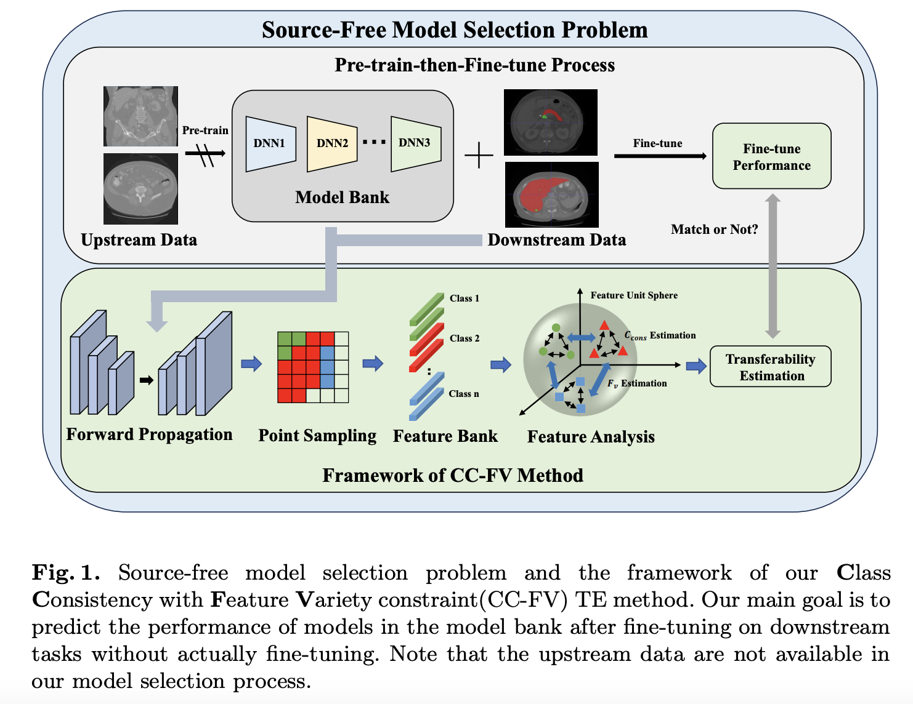

## Pick the Best Pre-trained Model: Towards Transferability Estimation for Medical Image Segmentation

* Authors: Yuncheng Yang, Meng Wei, Junjun He, Jie Yang, Jin Ye, and Yun Gu
* Published: MICCAI 2023
* Topic: Transferability estimation
* Link: https://arxiv.org/pdf/2307.11958.pdf

---

### What?

The paper introduces a new method for transferability estimation (TE) in semantic segmentation tasks. This approach assesses the capability of pre-trained models to adapt to different downstream datasets.

### Why?

The utility of foundation models across various tasks is not always predictable or quantifiable. Given the significant resources required for fine-tuning multiple models, it is important to estimate their generalization potential beforehand.

### How?

    

The method, named "Class Consistency and Feature Variety," comprises two metrics.

**Class consistency** relies on the assumption that a generalizable model should produce consistent class distributions even without fine-tuning. It uses the Wasserstein distance to compare feature distributions across images.

$$
  C_{cons} = \frac {1} {N(N-1)} \sum_{k=1}^{C} \sum_{i \neq j} W_2 (F_i^k,F_j^k) 
$$

where, $N$ is the number of samples, $C$ is the number of classes and $W_2$ is the **Wassertein distance**, calculated between the feature distribution of two images $(i,j)$ , estimated by randomly sampling a set of pixels/voxels.

> The Wasserstein distance is a metric that measures the distance between two probability distributions. 

**Feature diversity** $F_v^i$ measures the dispersion of sampling feature vectors $v$ within the global feature map, using the **hyperspherical potential energy** $E$ as a reference metric. This assesses the uniformity of the feature distribution.

> *"The feature vectors will be more widely dispersed in the unit sphere if the hyperspherical energy (HSE) is lower"*. 
> "The hyperspherical potential energy is defined as the sum of the potential energies of the individual particles, and it can be expressed as a function of the hyperradius, which is a measure of the overall size of the system. It is a way of representing the potential energy of a system of particles in a hyperspherical coordinate system". 

Finally, the transferability estimation from a pre-trained model $m$ to a dataset $t$ is calculated as:

$$
  T_{m \mapsto t} = \frac 1 D \sum_{i=1}^D \log \frac {F_v^i} {C_{cons}^i}
$$ 

where $D$ is the number of decoder layers.

### And
The authors proposed a novel benchmark setup for their study. They prepared a model bank for each of the five downstream datasets by pre-training on the other four datasets.

The TE method's effectiveness was evaluated through Kendall's $\tau$ and Pearson correlation, comparing the TE scores with actual model performance on the datasets. These statistical measures helped validate the predictive accuracy of the TE method in determining the adaptability of models to different datasets.

> The Kendall's $\tau$ goes from -1 to 1, where 1 means perfect correlation. It is used to measure the ordinal association between two measured quantities.