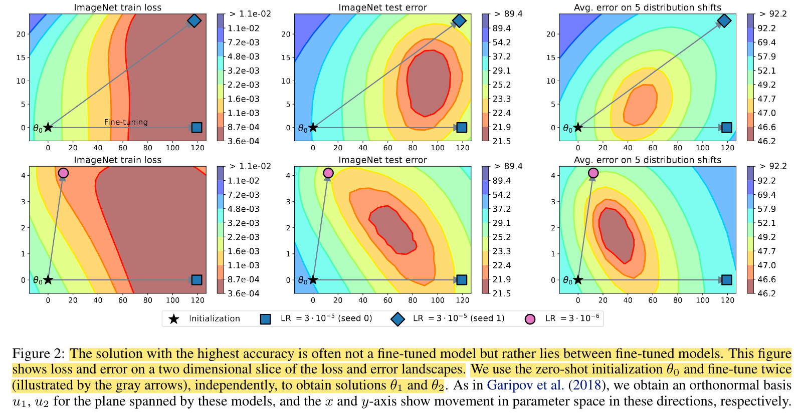
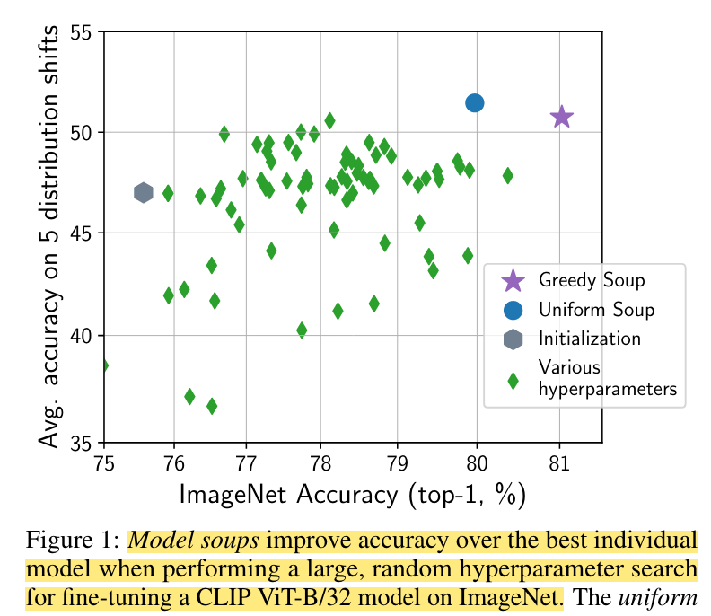

## Model soups: averaging weights of multiple fine-tuned models improves accuracy without increasing inference time

* **Authors**: Mitchell Wortsman, Gabriel Ilharco, ..., Yair Carmon, Simon Kornblith, Ludwig Schmidt
* **Published**: ICML 2022
* **Topic**: Ensemble, Averaging
* **Link**: https://arxiv.org/pdf/2203.05482.pdf

---

### What?
The authors present a different ensembling approach where, instead of averaging prediction scores from multiple models, they average the weights of various models that have been fine-tuned using different hyperparameters.

### Why?
Hyperparameter tuning is typically focused on identifying the optimal model configuration based on validation set performance. However, the authors argue that model averaging could yield superior overall performance and enhance robustness against distribution shifts.

### How?
They introduce the concept of **model soup**, which is an average of fine-tuned models, and suggest three distinct **recipes** for this:
	- Uniform: averages all fine tuned models
	- Greedy: sequentially add new models if the soup (average) improves the validation performance
	- Learned: optimizes model interpolation weights by gradient-based mini-batch optimization

Notably, unlike traditional ensemble techniques, this approach does not require storing all models or performing inference with each, thus maintaining an O(1) inference cost.

The authors illustrate their intuition with an example: the highest accuracies are often found between pairs of fine-tuned models.

    

The evaluation covers:
- **Classification**: ImageNet-1k
- **Distribution** shifts: ImageNetV2,ObjectNet, ImageNet-R/A/Sketch

    

### And?
This work is both inspiring and clearly written, particularly in how it presents the intuition and the experiments. However, one critical point of concern is the assumption of having a clean validation set. The authors use 2% of ImageNet's training images (~25k), which, while standard for such evaluations, may be quite ambitious in real-world scenarios.