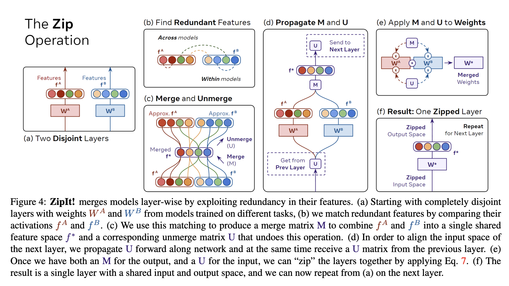
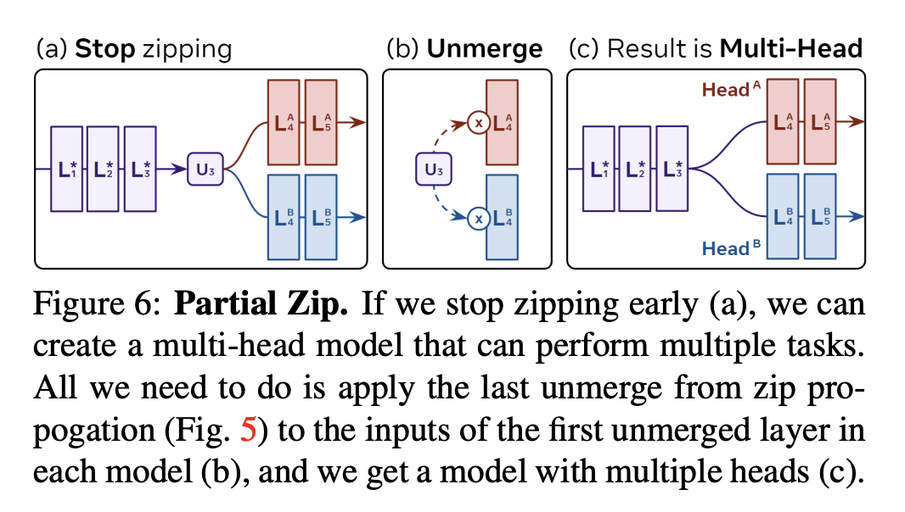

## ZipIt! Merging Models from Different Tasks without Training

* Authors: George Stoica*, Daniel Bolya*, Jakob Bjorner, Taylor Hearn,Judy Hoffman
* Published: ArXiv (2023)
* Topic: Models merging
* Link: https://arxiv.org/pdf/2305.03053.pdf
* Review: https://openreview.net/forum?id=LEYUkvdUhq

---

### What?
ZipIt is a novel approach for merging different models, trained on separate tasks. This method requires no additional training and leverages shared features across models. The goal, therefore, is to create a unified model from multiple checkpoints, each proficient in distinct domains.

### Why?
In the realm of continual learning, avoiding the retraining of models on entire datasets is crucial, especially considering the issue of catastrophic forgetting. ZipIt aims to solve this by training models on separate tasks and subsequently merging them, offering a solution to this challenge.

### How?
To merge feature spaces, ZipIt concatenates feature vectors from corresponding layers and analyzes the correlation between paired elements. Features with high correlation are averaged. However, this makes subsequent layers incompatible. To tackle this, the authors suggest a "fake undo" transformation, relocating merged features to their original positions.

    

Additionally, the authors propose a partial merging, which merges early layers and leave separate later ones, simulating a shared backbone and multi-heads. This enhances flexibility for less correlated models (e.g. trained on different datasets). 

    

### And?

ZipIt was  tested on disjoint subsets of classes within datasets like CIFAR-10, CIFAR-100, and ImageNet, as well as in multi-dataset settings. It showed improved state-of-the-art performance without the need for additional training.