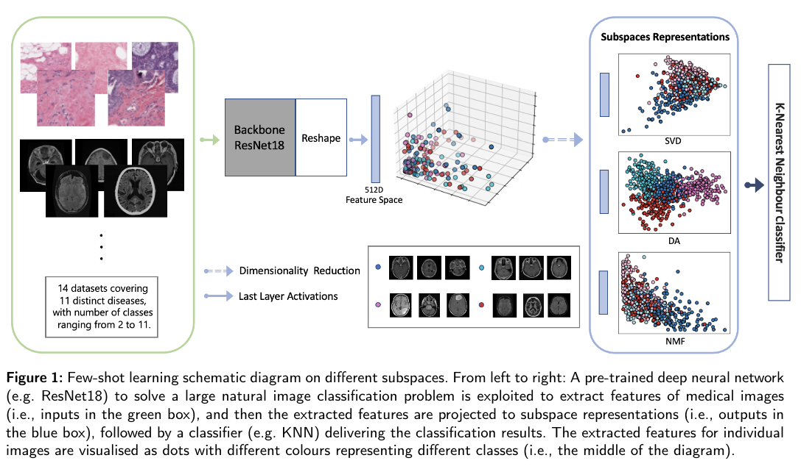

## Few-shot Learning for Inference in Medical Imaging with Subspace Feature Representations

* Authors: Jiahui Liu*, Keqiang Fan*, Xiaohao Cai, and Mahesan Niranjan
* Published: ArXiv, 2023 (As of January 2024)
* Topic: Pre trained networks, kNN, dimensionality reduction
* Link: https://arxiv.org/pdf/2306.11152.pdf

---

### What?

The paper presents a $k$-NN based approach for medical image analysis in limited data scenarios, utilizing subspace feature representations that are generally less sparse and more compact.

### Why?

Medical imaging often suffers from a lack of large datasets, unlike natural image domains. A $k$-NN method combined with robust feature representation can overcome this data scarcity. However, the curse of dimensionality significantly impacts $k$-NN's performance, making dimensionality reduction techniques crucial.

### How?

    

A pre-trained ResNet18 serves as the feature extractor. The authors explore various dimensionality reduction techniques like SVD, NMF, SNMF, and LDA, alongside feature selection methods.

The performance were measured on random subsets of the MedMNIST data collection. The paper doesn't clarify whether stratified sampling was used to maintain the original distribution in these subsets.

### And?

As expected, LDA outperforms SVD, likely due to its supervised nature. However, LDA is limited by its output dimensions, leading to consideration of SNMF as an alternative. Despite promising results, feature selection methods may vary in effectiveness and require more time.

The paper's evaluation raises some concerns. For instance, the use of datasets with 200-300 samples might go outside the definition of 'few-shot' learning. Moreover, the test set presents between 20 to 88 samples due to the proposed subsampling. Here, the full test set might have been useful to reflect the method's effectiveness comprehensively

Finally, the choice of accuracy as a metric in typically imbalanced datasets might be suspicious, raising questions about whether the subsampling was intended to balance classes.