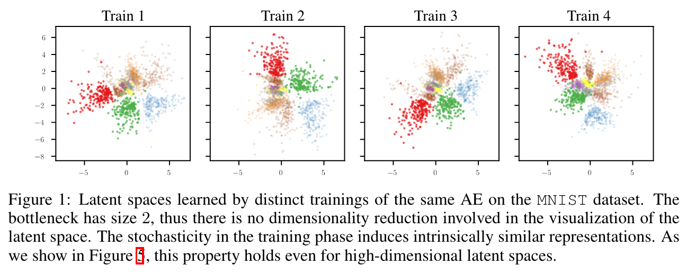
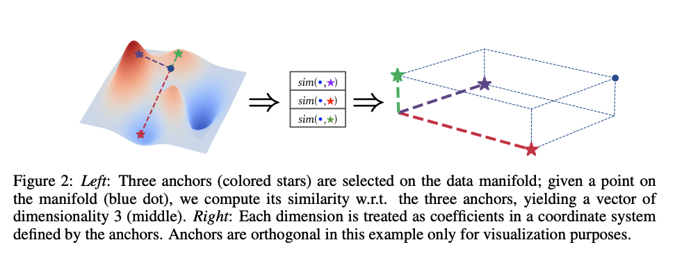
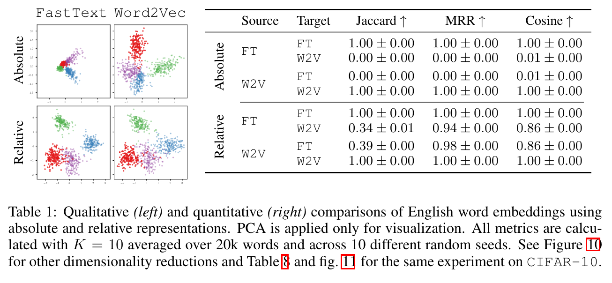

## Relative representations enable zero-shot latent space communication

* Authors: Luca Moschella*, Valentino Maiorca*, Marco Fumero, Antonio Norelli, Francesco Locatello, Emanuele Rodola'
* Published: ICLR 2023, Notable 5%
* Topic: Relative representation
* Link: https://arxiv.org/abs/2209.15430
* Slide: https://erodola.github.io/slides-rae/

---

### What?

The authors introduce a method for creating relative representations in latent spaces, designed to be invariant to stochastic factors introduced via model training.

### Why?

Hyperparameters (e.g. random seed, weights initialization, shuffling..) significantly alter the latent space distribution despite underlying similarities.

This is the major challenge of model stiching, which involves swapping components of different networks (e.g encoder/decoder). In order to correcly *stiching* groups of networks, we require to learn similar representations. 

    

### How?

The method starts with selecting a set of anchors $\mathbb{A} \in \mathbb{X}$. Each sample is then represented in relation to these embedded anchors $e_{a^{(j)}} = E(a^{(j)})$ (with $a^{(j)} \in \mathbb{A}$), using the cosine similarity. The relative representation of $x^{(i)} \in \mathbb{X}$ is defined as:

$$
r_{x^{(i)}} = (sim(e_{x^{(i)}},e_{a^{(1)}}), ... , sim(e_{x^{(i)}},e_{a^{(|\mathbb{A}|)}}))
$$

    

> The latent invariance is obtained by means of the cosine similarity, because it is invariant to rotations, reflections and rescaling (i.e., angle-preserving transformations).

### And?

Experiments on Word Embedding models quantitatively (Word2Vec & FastText) and qualitatively show the difference of the absolute representation and the the similarity of the relative ones.

    

Some other key findings:

* Models with latent spaces similar to a reference model (known for good accuracy) perform better.
* Using relative representation doesn't compromise performance.

Finally, under model stiching settings (including reconstruction, text, and image classification), relative stitching significantly outperformed absolute stitching