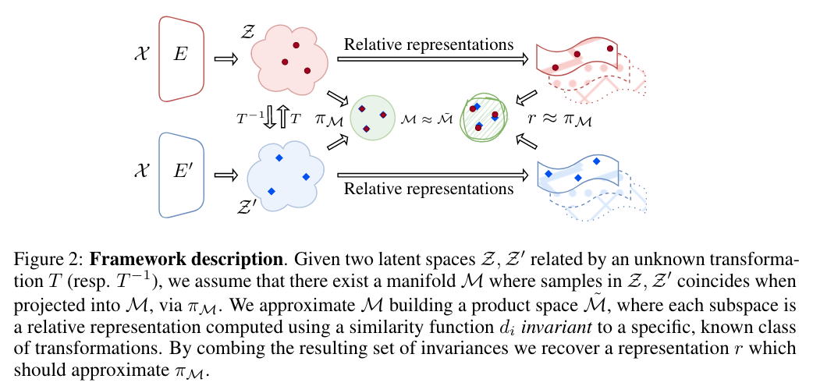
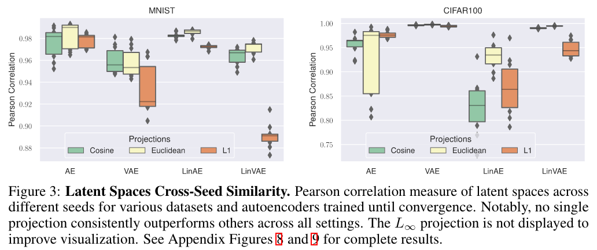

## From Bricks to Bridges: Product of Invariances to Enhance Latent Space Communication

* Authors: Irene Cannistraci, Luca Moschella*, Marco Fumero*,  Valentino Maiorca
* Published: ICLR 2024, Notable 5%
* Topic: Latent Space Communication
* Link: https://arxiv.org/pdf/2310.01211.pdf
* Review and improved paper: https://openreview.net/forum?id=vngVydDWft

---

### What?

The authors propose to incorporate a set of invariances into the latent space representation. This is achieved by constructing a product space of invariant components on top of the latent representations. 

### Why?

Previous work [1] use relative latent representation (RR) to enforce invariance to angle-preserving transformation of the latent space.  However, transformations between different neural networks often involve more complex changes. Thus, the authors expand their previous work by incorporating a set of invariances into the latent space representation. This allows to to capture abritrary complex transformations of the latent space.

### How?

    

This work is based on the assumption that there exists a manifold $\mathcal{M}$ which identifies an equivalence class of of encoders $\mathcal{E}_{\mathcal{T}}$ induced by the class of transformations $\mathcal{T}$. Thus, the goal is to find a function $r$ that independently projects the latent spaces into $\mathcal{M}$ and it is invariant to $\mathcal{T}$, which means $r(z)=r(Tz)$, for $T \in \mathcal{T}$ and $z \in \mathcal{Z_1},...,\mathcal{Z_n}$. 

$$
r(z) = \phi \, \circ \, RR(z; A_{\mathcal{X},d_i}), \quad \forall d_i \in \mathcal{D}
$$

where $\phi$ is the aggregation function (e.g. concatenation), $\mathcal{D}$ is the set of similarity functions, and $A_{\mathcal{X}}$ is a set of anchors

While [1] used only the Cosine similarity as $\mathcal{D}$, here the authors use all the following similarities: Cosine, Euclidean, Manhattan, Chebyshev and Geodesic. As aggregation function $\phi$, the authors explore the concatenation, aggregation by sum and self-attention. 

### And?

There is no single class of of transformations that is consistently better across different models trained from scratch.

    

The same applies for pre-trained models (both image and text-based models), and for zero-shot stiching across image, text, and graph modalities. Therefore, expanding the set of similarities becomes particularly valuable to well generalize.

---

[1] Moschella, L., Maiorca, V., Fumero, M., Norelli, A., Locatello, F., & Rodola, E. (2022). Relative representations enable zero-shot latent space communication. arXiv preprint arXiv:2209.15430.