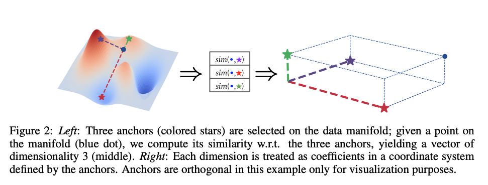

## From Charts to Atlas: Merging Latent Spaces into One

* Authors: Donato Crisostomi, Irene Cannistraci, Luca Moschella, Pietro Barbiero, Marco Ciccone, Pietro Liò, Emanuele Rodolà
* Published: Proceedings of Machine Learning Research 2023
* Topic: Latent Space Communication
* Link: https://openreview.net/pdf/8d06738ed8b1ba27bd86596469053fe90217f79f.pdf

---

### What?

The authors present a two-step method for aggregating latent spaces, initially using relative representations [1] from each space and then merging them. This is based on the idea that models trained on similar tasks should exhibit comparable inter-sample relationships.

### Why?

Aggregating latent space is particulary useful for continual and federated learning. Unlike existing methods that work with weights, this approach focuses on latent spaces, allowing flexibility in architecture (sort of).

### How?

    

Building on prior work on relative representation [1], the method involves using a set of anchors to define each sample's position in relation to the anchors using cosine similarity ([see more](./05_moschella2023relative.md)).

    

> Image from [1]

Notably, the anchors should be selected as the image commonly seen by each model. Otherwise, in case of independent tasks, the images must not seen by any model, in order to avoid biased representations. The final aggregation function maps these relative spaces into a single one, averaging representations when a sample appears in less than the total number of latent spaces.

$$
x_{agg} = \frac 1 K \sum_{k=1}^K X_r^{k}
$$

> $K < M$, where $M$ is total number of latent spaces.

Thus, if the spces are disjoint, the aggregated repersentation will be equal to the relative one, otherwise they are averagd. The average is employed in order to cope with noise from multiple representations. If they align, they will be equal.

### And?

The approach was evaluated under three scenarios

* Tasks sharing a set of samples
* Tasks sharing the same classes but disjoint samples
* Tasks disjoin both at the class and at the sample level

> The Centered Kernel Alignment (CKA) [2] is used as evaluation metric. It is commonly used to compare neural representations.

In short, the method works better with shared samples or classes, while its performance are slightly degraded with disjoint samples or classes. 

---

[1] Moschella, L., Maiorca, V., Fumero, M., Norelli, A., Locatello, F., & Rodola, E. (2022). Relative representations enable zero-shot latent space communication. arXiv preprint arXiv:2209.15430.

[2] Kornblith, S., Norouzi, M., Lee, H., & Hinton, G. (2019, May). Similarity of neural network representations revisited. In International conference on machine learning (pp. 3519-3529). PMLR.