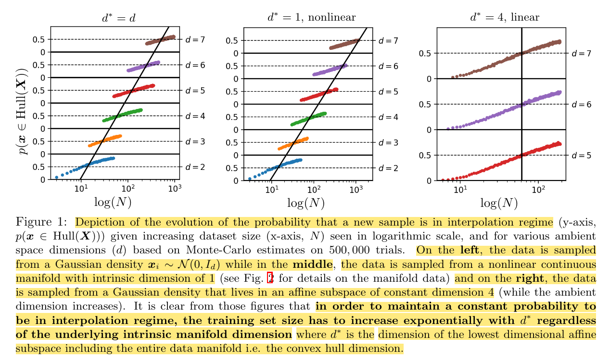

## Learning in High Dimension Always Amounts to Extrapolation

* Authors: Randall Balestriero, Jeome Pesenti, and Yann LeCun
* Published: ArXiv, 2021
* Topic: Interpolation, Extrapolation, Convex Hull
* Link: https://arxiv.org/abs/2110.09485
* Additional resource: https://lauraruis.github.io/2021/11/06/extra.html
---

### What?

The authors demonstrate, both empirically and theoretically, that interpolation does not occur in high-dimensional spaces (dimensions greater than 100). Thus, we shouldn't use the notion of interpolation and extrapolation to asses the generalization performance of our models, as those models will be likely to extrapolate.

### Why?

Commonly, there's an assumption that our models can effectively interpolate training data. However, it's crucial to recognize that in the realm of high-dimensional datasets, an exponential increase in data is necessary. Consequently, the authors argue that, in practice, what is often perceived as interpolation is actually extrapolation.

### How?

To establish the main argument, we initially define interpolation: a sample $x$ is considered to interpolate when it falls within the convex hull of a set of samples $X$; if not, the process is termed extrapolation.

The discussion then progresses to the requirement for exponential data. This concept is encapsulated a Theorem introduced by Bárány and Füred in 1988. According to this theorem, the likelihood of a sample $x$ being within the convex hull of $X$ is certain (probability 1) only if $N > d^{-1}2^{d/2}$, where $N$ is the dataset size and $d$ is the dimensionality. Otherwise, this probability is zero, highlighting the exponential growth in data needed for interpolation to occur in higher dimensions.

### And?

Although one may assume the data lie in a lower-dimensional manifold, hopefully circumventing these constraints, the authors conclusively demonstrate that their findings hold even within a 1-dimensional manifold.

    

Furthermore, they validate their claims across both pixel and latent spaces, leaving nothing to chance.
