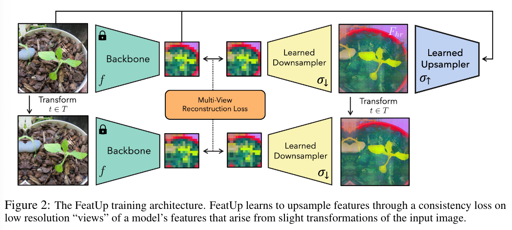
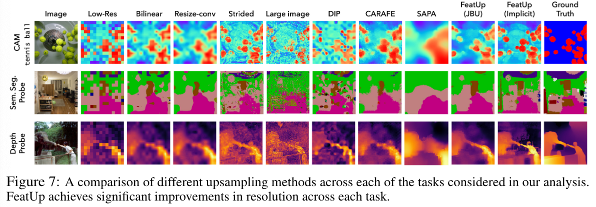
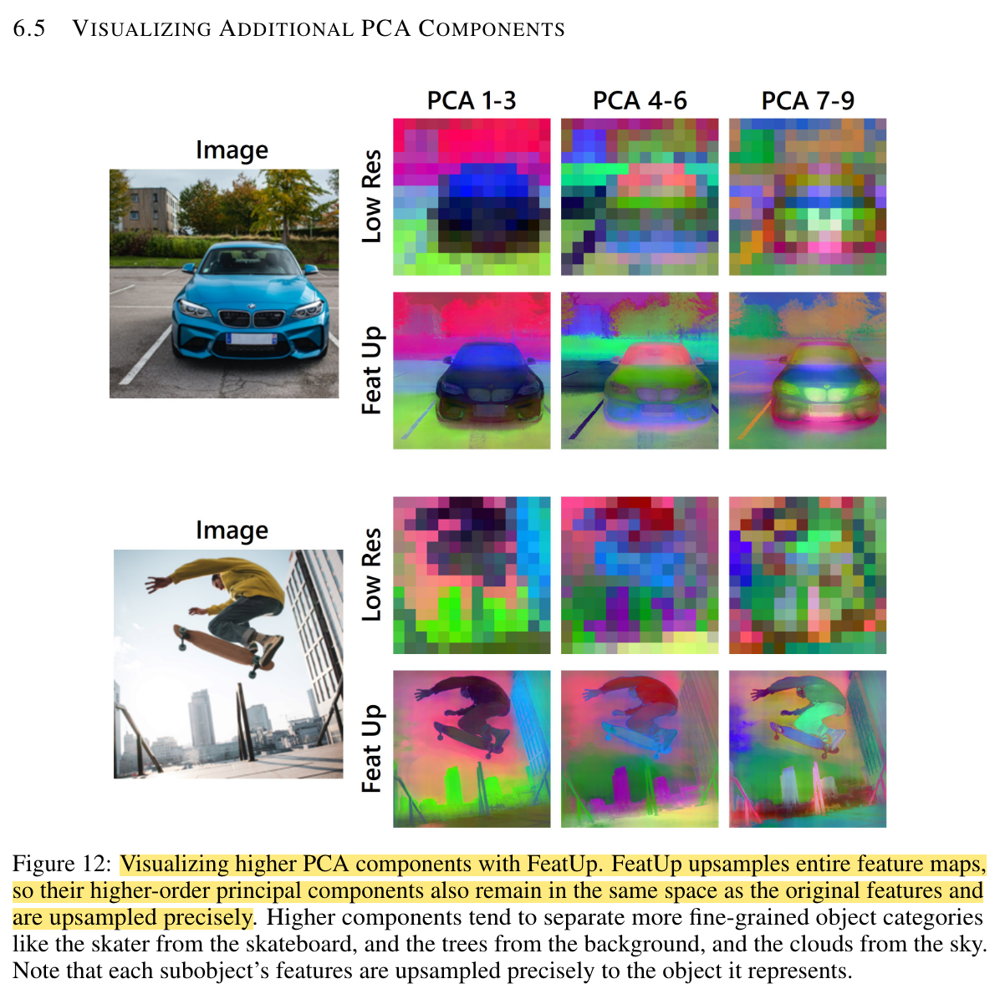

## FeatUP: A Model-Agnostic Framework for Features at Any Resolution

* Authors: Stephanie Fu*, Mark Hamilton*, Laura Brandt, Axel Feldmann, Zhoutong Zhang, William T. Freeman
* Published: ICLR 2024
* Topic: Deep features upsampling
* Link: https://arxiv.org/abs/2403.10516
* Website: https://mhamilton.net/featup.html

---

### What?

FeatUp is a backbone-agnostic method designed for upsampling deep features.

### Why?

Deep features, while rich in information, significantly downsample the input image, resulting in a significant loss of spatial details. Upsampling these deep features is crucial for improving model interpretability and enhancing performance in tasks such as semantic segmentation and depth prediction.

### How?

    

Drawing inspiration from the NeRF literature, FeatUp enforces consistency across different views of an image. Initially, an image and its various "views" -- obtained through image perturbations -— are downsampled using a selected backbone. The original feature map is then upscaled using a **learned upsampler**. This upscaled version is subjected to the same perturbations as before and processed by a **learned downsampler** to compute the reconstruction loss, defined as:

This reconstruction loss is defined as:

$$
\mathcal{L}_{rec} = \frac 1 T \sum_{t \in T} \frac 1 {2s^2} || f(t(x)) - \sigma_{\downarrow}(t(F_{hr}))||_2^2 + log(s)
$$

Here, $T$ represents the set of transformations applied, $x$ the input image, $f$ the frozen backbone, $\sigma_{\downarrow}$ the learned downsampler, and $F_{hr}$ the predicted high-resolution features from the learned upsampler. The parameter $s = \mathcal{N}(f(t(x)))$ introduces spatially varying uncertainty, modeled by a compact linear network $\mathcal{N}$, transforming a straightforward MSE into an appropriate likelihood function [1].

Two versions of the learned downsampler $\sigma_{\downarrow}$ are proposed:

1. A straightforward and efficient **blur kernel**, applied as a convolution to each channel.
2. A versatile **attention-based** downsampler, utilizing $1{\times}1$ convolutions to generate saliency maps from high-resolution features. These maps are then integrated using learned spatially invariant weights and bias kernels.

Similarly, the learned upsampler $\sigma_{\uparrow}$ is presented in two variants:

1. The Joint Bilateral Upsamplers (JBU) approach, employing a sequence of parametrized JBUs. JBU merges joint bilateral filtering's edge-preserving qualities with the concept of upsampling, using a high-resolution guidance image to refine the upsampling of a lower-resolution target image.

$$
F_{hr} = (JBU(\dot,x) \circ JBU(\dot ,x) \circ ...)(f(x))
$$

2. The implicit rendering method, inspired by NeRF, defines high-resolution features through an implicit function $F_{hr} = \text{MLP}(z)$. This approach is enhanced by Fourier positional features, enabling the network to capture high-frequency color information from the original image.

### And?

The qualitative outcomes are notably impressive, with the high-resolution images containing significantly denser information. This enhanced detail can be utilized in various ways, as illustrated below.

    

This increase in information density is also supported by their ablation study on PCA features, as shown below.

    

Moreover, FeatUp has shown to improve performance in downstream tasks such as semantic segmentation and depth estimation. While these advancements were somewhat expected, I am genuinely curious to explore its classification performance. Given the preservation of overall semantics despite the increased volume of information, I believe it is not trivial to expect a boost in classification performance as well. 

### References

[1] :  Hamilton, Mark, Evan Shelhamer, and William T. Freeman. "It is likely that your loss should be a likelihood." ICLR 2021 [[link](https://arxiv.org/abs/2007.06059)].