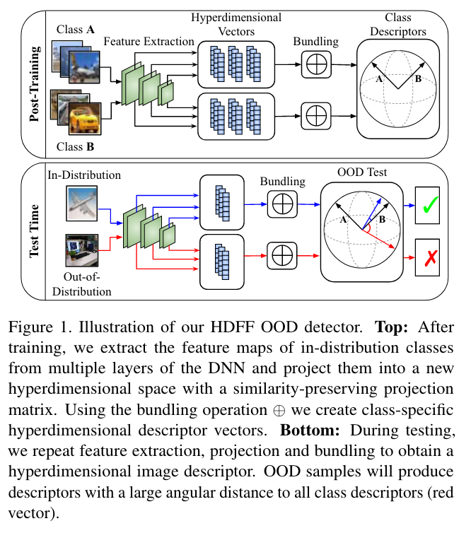

## Hyperdimensional Feature Fusion for Out-of-Distribution Detection

* Authors: Samuel Wilson, Tobias Fischer, Niko Sunderhauf, Feras Dayoub
* Published: WACV 2023
* Topic: Hyperdimensional Computing, Feature Fusion, OOD
* Link: https://openaccess.thecvf.com/content/WACV2023/papers/Wilson_Hyperdimensional_Feature_Fusion_for_Out-of-Distribution_Detection_WACV_2023_paper.pdf

---

### What?

This paper introduces a novel out-of-distribution (OOD) detection approach leveraging the **hyperdimensional computing** paradigm. It generates hyperdimensional descriptor vectors for training classes, which are subsequently utilized at inference time to assess the likelihood of a sample being OOD.

### Why?

Conventional OOD detection methods typically leverage the output of a single network layer, potentially neglecting sensitive information present across various layers. 
This approach aggregates hyperdimensional vectors across different network stages and samples, achieving a more accurate and robust class description. 

### How?

    

#### Background: Hyperdimensional Computing

**Hyperdimensional Computing** (HDC) works in very large spaces (e.g., $10^4$), aiming to preserve and enrich semantic semantic power though large and redundant feature vectors. Redundancy in this context implied that with such large dimensional space, **any two random vectors are quasi-orthogonal**. 

In HDC, vectors represent the **associations between data points**, while associative memory is constructed by means of a set of representative vectors, obtained through standard operations among hyperdimensional vectors. Key operations include bundling $\oplus$ and binding $\otimes$. 

The bundling operation fuses multiple vectors into a representation that maintains the similarity of all input vectors through element-wise addition and normalization. Conversely, binding merges a set of vectors into a representation distinct from all inputs, exploiting the quasiorthogonality of HD spaces to produce a vector orthogonal to all inputs in the cosine similarity space.

The **vectors** are represented as the associations between data points, while **associative memory** is defined by the set of representative vectors, obtained by means of standard operations with respect to HD vectors. Two operations are *bundling* $\oplus$ and *binding* $\otimes$. 

These operations are performed in a newly projected HD space rather than the original input space, with task-specific projection matrices or other techniques.

#### Hyperdimensional Feature Fusion (Method)

The paper proposes the Hyperdimensional Feature Fusion (HDFF) technique, extending encoding and bundling to features extracted from various samples and network layers. The class-representative vector, derived through bundling operations, serves as an anchor during inference to evaluate the likelihood (via similarity) that a test sample is OOD.

Encoding involves a projection matrix $\mathbb{P}$, transforming a $c$-dimensional vector $v$ into an $m$-dimensional vector $h$. The projection matrices $P_l$ are designed to preserve the inner product between vector pairs, ensuring cosine similarity preservation. For each layer ($l$), this is represented as:

$$
h_l = P_lv_l
$$

An image descriptor, $y^{(i)}$, is determined through the bundling operator across all architecture layers:

$$
y^{(i)} = \oplus_{l=1}^L h_l^{(i)}
$$

The final class descriptors, $d_c$, are obtained by bundling all samples belonging to class $c$:

$$
d_c = \oplus_{i \in \mathbb{1}_c}^L h_l^{(i)}
$$

During testing, the **OOD score** is the minimum cosine similarity between the test class descriptor and the training class descriptors. An optimal OOD detection threshold, $\theta$, is identified within a range of 19-29 degrees, varying based on the task (e.g., NearOOD or FarOOD).

### And?

The authors evaluated the proposed method against the most recent literatures, including near- and far-OOD settings, achieving competitive or higher performances compared to traditional technniques, with a modest increase in computational cost.

### Extra: Useful literature

Out-of-Distribution Detection Using Union of 1-Dimensional Subspaces [[link]](https://openaccess.thecvf.com/content/CVPR2021/papers/Zaeemzadeh_Out-of-Distribution_Detection_Using_Union_of_1-Dimensional_Subspaces_CVPR_2021_paper.pdf)