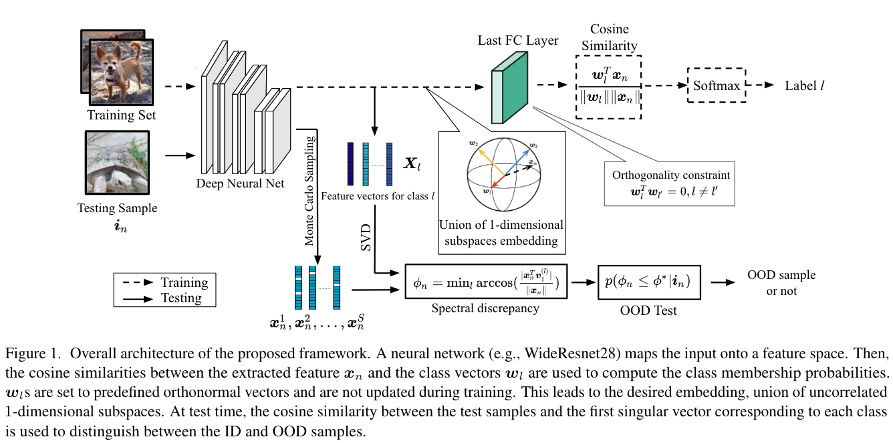
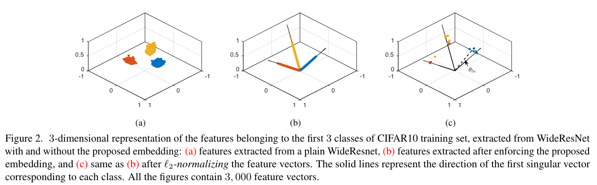
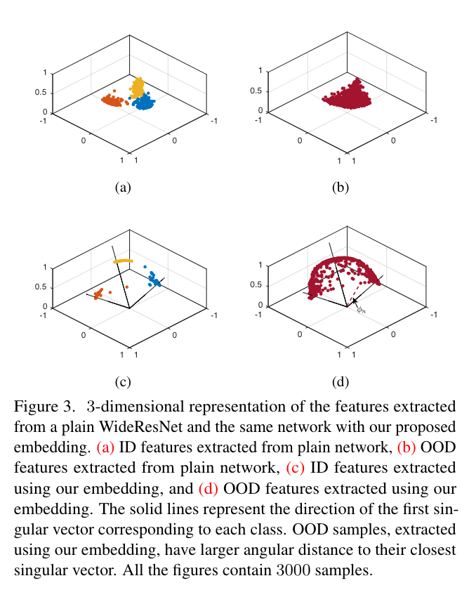

## Out-of-Distribution Detection Using Union of 1-Dimensional Subspaces

* Authors: Alireza Zaeemzadeh, Niccolò Bisagno, Zeno Sambugaro, Nicola Conci, Nazanin Rahnavard, Mubarak Shah
* Published: CVPR 2021
* Topic: Feature shaping, OOD
* Link: https://openaccess.thecvf.com/content/CVPR2021/papers/Zaeemzadeh_Out-of-Distribution_Detection_Using_Union_of_1-Dimensional_Subspaces_CVPR_2021_paper.pdf

---

### What?

This work introduces a novel OOD detection technique that operates in a lower-dimensional space constructed as the union of 1-dimensional subspaces, each representing a class axis. This approach enables a compact representation of feature spaces, significantly reducing the likelihood of OOD samples overlapping with in-distribution (ID) samples.

### Why?

Operating in lower-dimensional spaces facilitates a more compact representation of feature spaces, which inherently diminishes the probability of OOD samples falling within the same region as ID samples. The authors demonstrate that minimizing the error probability is achievable by condensing the distribution as much as possible.

Additionally, the authors show that the first spectral component is the more robust against perturbation and noise. In fact, the sensitivity of a $i-th$ spectral component to a given perturbation is measured as the gap between the associated eigenvalue $\lambda_i$ and the remaining eigenvalues $\lambda_j (j \neq i)$. Thus, since the gap between the eigenvalues is also decreasing, the first spectral component is the more robust one.  

### How?

    

Assuming the feature vectors belonging to the same class $l$ lie on a 1-dimensional subspace, the first singular vector of $X_l$ is used as a representative class-subspace. This requires to udapt the training scheme to maintain intra-class coherence and inter-class separation.

To **enforce intraclass constraint**, the softmax is adjusted using the cosine similarity:

$$
p_{l} = \frac {e^{|cos(\theta_l)|}} {\sum_l e^{|cos(\theta_l)|}}
$$

Here, the absolute value accounts for class membership being unaffected by the sign of the angle. This activation function aims to minimize the angle between a sample and its class-representative vector, and the loss function is then defined as follows:

$$
\mathcal{L} = \frac 1 N \sum_{n=1}^N -\log (\frac {e^{|cos(\theta_n^*)|}} {\sum_l e^{|cos(\theta_l)|}} )
$$

where $\theta_n^*$ denotes the angle between the n-th feature vector and the weight vector of the true label. 

To enforce the **interclass constraint**, the absolute cosine similarity ensures the feature vectors are angularly distributed in the space. However, to boost this separation, the authors initialize the weight matrix with orthogonal vectors and freeze them during training. 

    

The clever insight here, is that if the feature vectors belonging to a given class lie on a 1-dimensional subspace, the class-region has no volume. Thus, OOD samples should have probability of belonging to either of those regions close to 0. Formally, the probability of an input instance $i_n$ and corresponding feature vector $x_n$ is given by:

$$
p(\phi_n \leq \phi*|i_n)
$$

where:

$$
\phi_n = \min_l \arccos ( \frac {|x_n^T v_1^{(l)}|} {||x_n||})
$$

which is the minimum angular distance of the test feature from the first singular vector of any of the classes. This is named as **spectral discrepancy** and $\phi*$ is a critical value, which ideally accounts to 0. Finally, to account for hidden variability with respect to training distribution, the authors do no rely on a single point estimate, but on a Monte Carlo sampling.

    

### And?

Through extensive evaluations, this method showed superior performance over previous approaches, including those that leverage OOD samples for validation or adjustment. Moreover, it outpeformed reference methods in Action Recognition Tasks (UCF101 and HMDB51), showcasing its effectiveness across different applications.