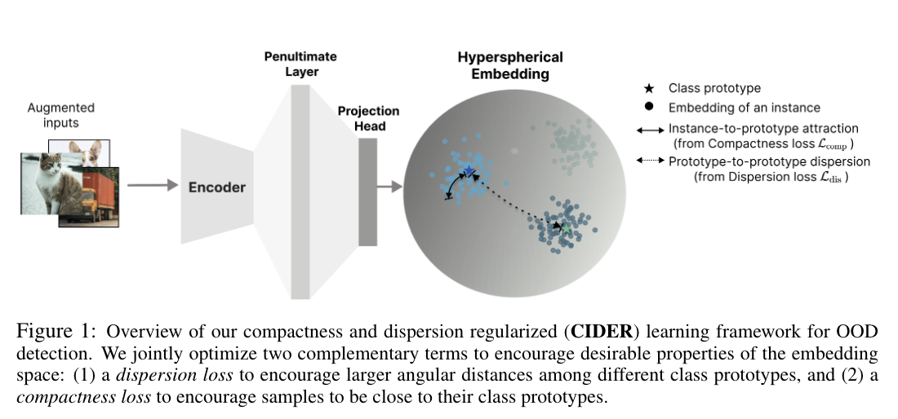

## How to Exploit Hypershperical Embeddings for Out-Of-Distribution detection?

* Authors: Yifei Ming, Yiyou Sun, Ousmane Dia, Yixuan Li
* Published: ICLR 2023
* Topic: OOD, Hypershperical Embeddings
* Link: https://openreview.net/pdf?id=aEFaE0W5pAd

---

### What?

The paper introduces CIDER, a novel representation learning method that leverages **hyperspherical embeddings** to enhance **out-of-distribution (OOD) detection**. It employs a **compactness loss**, designed to minimize the distance of samples to their respective class prototypes, alongside a **dispersion loss** which enforces increased angular distance between different class prototypes. 

### Why?

Prior works on OOD detection relied on the assumption that samples belonging to the same class should cluster closely together, with significant separation from samples of different classes. Achieving this requires a well-clustered feature space, an area where recent contrastive learning approaches have shown limitations. 

Thus, the authors propose a shift towards maximizing or minimizing angular distances, exploring hyperspherical embeddings and achieving state-of-the-art (SOTA) results.

### How?

    

CIDER models hyperspherical embeddings through the **von Mises-Fisher (vMF)** distribution, analogous to spherical Gaussian distributions but for unit norm features. The pdf for a unit vector $z \in \mathbb{R}^d$ in class $c$ is defined as:

$$
p_d(z;\mu_c,k) = Z_d(k)\exp (k\mu_c^\top z)
$$

where $\mu_c$ is the class prototype with unit norm, $k \geq 0$ indicate the tightness around the mean direction, and $Z_d(k)$ is the normalization factor.

With this in mind, the authors defined the compactness and dispersion loss enforcing this shperical shape. 

The **compactness loss** focuses on maximizing the correctness ratio, essentially the negative log-likelihood under spherical embeddings:

$$
\mathcal{L}_{\text{comp}} = - \frac 1 N \sum_{i=1}^N \log \frac {\exp(z_i^\top \mu_{c(i)} / \tau)} {\sum_j^{C} \exp(z_j^\top \mu_{c(j)} / \tau)}
$$

where $c(i)$ denotes the class index of sample $x_i$, and $\tau$ is a temparature parameter.

Contrary, the **dispersion loss** aims to maximize angular distance among different class prototypes.

$$
\mathcal{L}_{\text{dis}} = \frac 1 C \sum_{i=1}^C \log \frac 1 {C-1} \sum_{j=1}^C \mathcal{1}\{j \neq i\} e^{\mu_i^\top \mu_j / \tau}
$$

Interestingly, the **class-prototypes** are not defined a priori as a mean over feature vector, as they will change over the epochs. Thus, the authors effectively update them as exponential moving average during training:

$$
\mu_c := \text{Normalize} (\alpha \mu_c + (1-\alpha)z), \quad \forall c \in \{1,2,...,C\}
$$

where $\alpha$ is the prototype update factor.

The final loss function is a weighted sum of these components:

$$
\mathcal{L} = \mathcal{L}_{\text{dis}} + \lambda_c \mathcal{L}_{\text{comp}}
$$

where $\lambda_c$ is the coefficient modulating the relative importance. 

### And?

CIDER achieves SOTA results with respect to previous works for OOD, clearly showing the benefits of enforcing hypersherical embeddings for OOD detection tasks. 