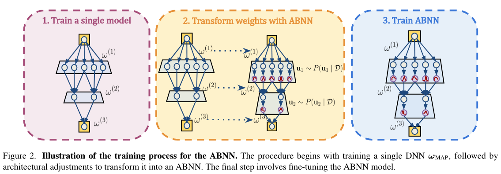

## Make Me a BNN: A Simple Strategy for Estimating Bayesian Uncertainty from Pre-trained Models

* Authors: Gianni Franchi*, Olivier Laurent*, Maxence Leguery, Andrei Bursuc, Andrea Pilzer & Angela Yao
* Published: CVPR 2024
* Topic: Bayesian Uncertainty
* Link: https://arxiv.org/pdf/2312.15297v1

---

### What?

The authors introduce ABNN (Adaptable Bayesian Neural Network), a simple yet efficient method to transform DNNs into Bayesian Neural Networks (BNNs) by perturbing normalization layers, thus introducing stochasticity.

### Why?

While Bayesian Neural Networks are effective in measuring uncertainty, they are extremely expensive to train due to the need to calculate the posterior distribution over the entire parameter space. Deep Ensembles provide a simpler alternative by averaging predictions across multiple models, but this still requires training several models, which remains costly.

### How?

    

To convert pre-trained DNNs into BNNs, the authors propose replacing all normalization layers with random Gaussian perturbations. This simple yet effective technique introduces stochasticity into the training process, transforming the network into a Bayesian one with only a further fine-tuning step required.

To enhance model robustness, the authors train multiple ABNNs using different weight configurations. 

> This approach is similar to Deep Ensembles. However, instead of training the networks from scratch, they fine-tune multiple times, which is more efficient.

As in MCDropout, during inference, for each sample parameter configuration $\omega_m \in M$ with $m \in [1,M]$, the number of samples is further increased by sampling multiple noise configurations $\epsilon_l \sim \mathcal{N}(0,1)$, with $l \in [1,L]$. Thus, the class probability is given by:

$$
P(y|x,\mathcal D) = \frac 1 {ML} \sum_{l =1}^L \sum_{m =1}^M P(y|x, \omega_m, \epsilon_l)
$$

To prevent all models from collapsing into the same local minima during the fine-tuning stage, the authors extend the MAP loss function with a class-dependent random weight. This enforces variability across each parallel run.

### And?

The experiments were performed using ResNet50, WResNet50, and ViT for classification and DeepLabV3+ (with ResNet50) for segmentation, utilizing standard evaluation datasets and settings.

ABNN is nearly as efficient as the Laplace ensemble (the most efficient) and achieves comparable performance to Random Ensembles (highest performances), which are much less efficient, thus achieving a desirable tradeoff.

However, this comes at the expense of training instabilities. Although ABNN mitigates the inefficiency of BNNs, the authors observe a standard deviation of the gradients five times larger than traditional DNNs, indicating that training instability remains a significant issue.

### ... and?

> Since one of the authors' contributions focuses on overall training time and efficiency, it might be fair to compare this with Monte Carlo Dropout. The authors still train multiple networks to enhance training stability, whereas MCDropout requires only one training run. Even though MCDropout might be more efficient, are the performance differences large enough to justify the additional complexity of ABNN?