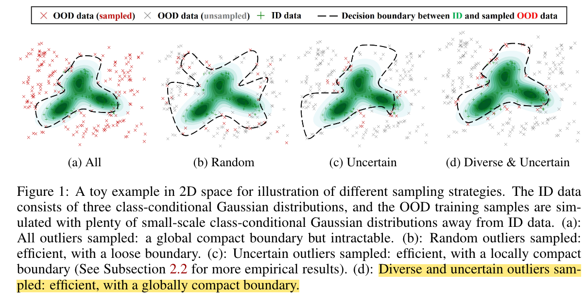

## DOS: Diverse Outlier Sampling for Out-of-Distribution Detection

* Authors: Wenyu Jiang, Hao Cheng, Mingcai Chen, Chongjun Wang, Hongxin Wei
* Published: ICLR 2024
* Topic: OOD, Sampling
* Link: https://openreview.net/forum?id=iriEqxFB4y

---

### What?

The authors propose DOS, a diverse (unlabeled) outlier sampling strategy for outlier exposure (OE) to enhance out-of-distribution (OOD) detection.

### Why?

Typical OE techniques rely on random or greedy sampling, which might return biased and/or non-informative outliers.

### How?

    

The main idea of DOS (Diverse Outlier Sampling) is to choose outliers that are relevant, meaning those that lie close to In-Distribution (ID) samples.

To achieve diversity, the first step involves clustering via k-means over the normalized features extracted with the same feature extractor used for training. Then, to select the most informative samples, for each cluster, the closest samples to the decision boundary are chosen. This is modeled using the inverse absent category probability.

> Given $N$ classes, this refers to the probability of the softmax calculated on a "novel" (absent) class $N+1$: $$1.0 - P(N+1|x)$$.

The objective function is a modified Cross Entropy which considers both ID data (using the known classes) and the OOD data, using the fake "absent" class N+1. 

### And?

The authors evaluated DOS on a wide range of tasks and datasets, and their summarized results are as follows:
* DOS achieves superior performance on the common benchmark (CIFAR100-INRC).
* DOS shows consistent superiority across different auxiliary OOD datasets (TI-300K).
* DOS is effective on the large-scale benchmark (ImageNet-10 as ID and ImageNet-990 as the auxiliary data).
* DOS shows generality and effectiveness with energy loss (this proved that this can be jointly used with further regularization techniques).
* DOS is robust with varying scales of the auxiliary OOD dataset.

In their discussion, the authors highlight the slower computation due to the required clustering at every batch. Lastly, they also show that OE can be beneficial for large pre-trained models, even though they are inherently robust.
