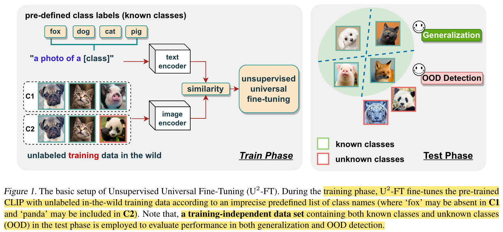

## Realistic Unsupervised CLIP Fine-tuning with Universal Entropy Optimization

* Authors: Jian Liang, Lijun Sheng, Zhengbo Wang, Ran He, Tieniu Tan
* Published: ICML 2024
* Topic: Unsupervised Fine-Tuning, CLIP
* Link:  https://openreview.net/pdf?id=XxCfToC9pJ

---

### What?

The authors introduce a novel fine-tuning setup named Unsupervised Universal Fine Tuning, using CLIP. Additionally, to address the degradation of fine-tuning performance in the presence of out-of-distribution (OOD) samples, they propose a parameter-efficient approach called Universal Entropy Minimization.

### Why?

In real-world settings, fine-tuning often occurs with unlabeled and noisy data, which may include OOD samples. However, typical approaches usually assume clean and labeled data.

### How?

    

The proposed fine-tuning pipeline (see image above) aims to detect and weight in-distribution (ID) samples and out-of-distribution (OOD) samples differently to avoid negatively affecting fine-tuning performance.

OOD samples should, in principle, have a high dissimilarity to all the training (in-domain) classes. This motivates the choice of entropy maximization for ID samples and maximization for OOD samples. The maximum softmax probability has already proven to achieve remarkable performance for OOD detection. Therefore, the authors use these scores as sample-level weights $w(x)$  to guide the optimization process.

The objective function:

$$
\mathcal L = \sum_{x \in \mathcal{B}_t} \tilde w (x) \mathcal H(p(x)) - \mathcal H(\overline p)
$$

where $x$ denotes a sample of the minibatch $\mathcal{B}_t$, $\tilde w (x)$ the normalized weight, $\mathcal H(\cdot)$ the Shannon entropy. Lastly, $\overline p$ is the weighted average of predictions for each sample within the minibatch, weighted with a monotonically decreasing function with respect to $w$, which takes care of the OOD samples, if any.

During the fine-tuning process, they propose optimizing the text prompts (i.e., the learnable word vectors) as in previous works, and also the affine parameter space by optimizing the normalization layers of the image branch.

### And?

The authors evaluate performance under image classification tasks, measuring per-class accuracy to assess generalization performance, AUC score for OOD detection, and the harmonic mean between the two metrics.

They achieved consistently higher performance using pre-trained ResNet50 and ViT-B/16 on several tasks:

* Closed-set category shift: training and testing on the same set of categories, but with distributional differences.
* Partial-set category shift: training on a subset of categories and testing on a broader set that includes unseen categories.
* Open-set category shift: training on certain categories but encountering completely new, unseen categories during testing.
* Open-partial-set category shift: training on a subset of categories, and during testing, facing both seen and unseen categories.

