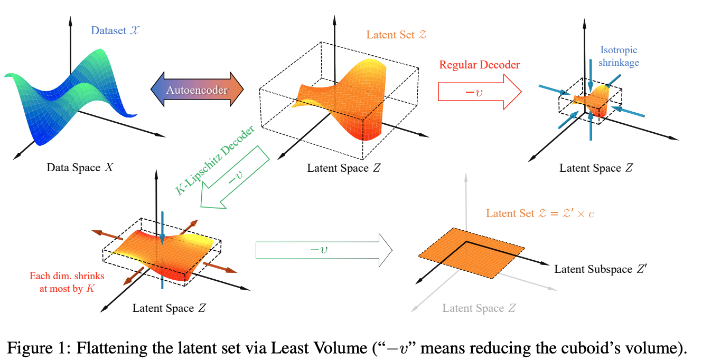

## Compressing Latent Space via Least Volume

* Authors: Qiuyi Chen & Mark Fuge
* Published: ICLR 2024
* Topic: Dimensionality Reduction
* Link: https://openreview.net/pdf?id=jFJPd9kIiF

---

### What?

This paper introduces Least Volume, an autoencoder-based dimensionality reduction technique that does not require prior knowledge of the intrinsic dimensionality of the dataset.

### Why?

The usual assumption is that a high-dimensional dataset resides on a low-dimensional manifold. Therefore, reducing its dimension might be beneficial for downstream tasks, both in terms of information preservation and computational efficiency.

### How?

> *"Concretely speaking, if through the lens of the manifold hypothesis we conceive the dataset as an elastic curved surface in the high dimensional data space, then the latent set can be regarded as an intact “flattened” version of it tucked into the low dimensional latent space by the encoder.  Therefore, the task of finding the least dimensional latent space can be imagined as the continuation of this flattening process"*

    

To flatten the latent space, we aim to promote sparsity concerning the standard deviation vector. We typically enforce this sparsity by means of the $L_1$ norm, however, it doesn't lead toward flattening. To promote sparsity and flattening, the authors propose to use as regularizer the product of all elements in the latent code's STD vector $\mathbf{\sigma}$.

$$
\prod_i \sigma_i
$$

The intuition is that a curved surface can only be enclosed by a cuboid of much larger volume than a cuboid that encloses its flattened counterpart. This cuboid has its sides parallel to the latent coordinate axes. Thus, when the volume is minimized, the flattened latent is also aligned with those axes. To approximate the volume of this cuboid, the authors consider the standard deviation of each component as the length of each side of the cuboid.

However, to escape from the trivial solution ($\sigma_i = 0$), the authors propose a Lipschitz regularized on the AE's decoder. This way, while the encoder tries to push toward this trivial solution, the decoder fights back by scaling up the weights so that small perturbations in the latent input still induce large enough output variations in data space to achieve a low reconstruction error. To do this, however, the decoder must possess a large Lipschitz constant ($K$) by definition.

Thus, for an unsupervised representation learning problem in which the latent set $\mathcal Z = e_\theta(\mathcal X)$ is required to preserve enough information of a dataset $\mathcal X$ — as per the criterion that it minimizes a reconstruction loss function $J(g\theta(\mathcal Z), \mathcal X)$:

$$
\argmin_\theta L_{vol}(\mathcal Z) = L_{vol} (e_\theta(\mathcal X))
$$

$$
s.t. \mathcal Z \in Z:= \{ \mathcal Z = e_\theta(\mathcal X) | \text{ minimizes } J(g_\theta \circ e_\theta (\mathcal X), \mathcal X)\} \\
||g_\theta(z_1) - g_\theta(z_2)|| \leq K ||z_1-z_2|| \quad \forall \{z_1,z_2\} \in Z
$$

### And?

This dimensionality reduction technique was evaluated on reconstruction, explainability (using the "importance score" of each component), and classification (kNN) over the latent representations.

It achieves better dimension reduction results than several $L_1$ distance-based counterparts on multiple benchmark image datasets. Furthermore, for classification tasks, while it achieves slightly lower performance than $L_1$ regularization, it substantially outperforms other regularizers on CIFAR-10, even though the overall performance is quite low (~35/40%).

