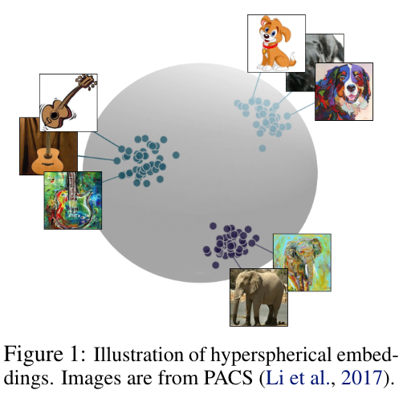
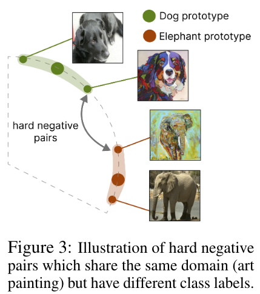
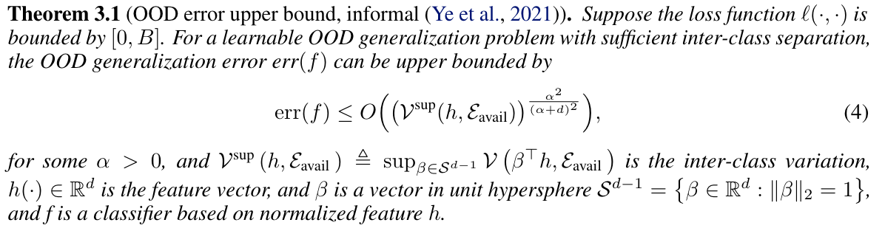
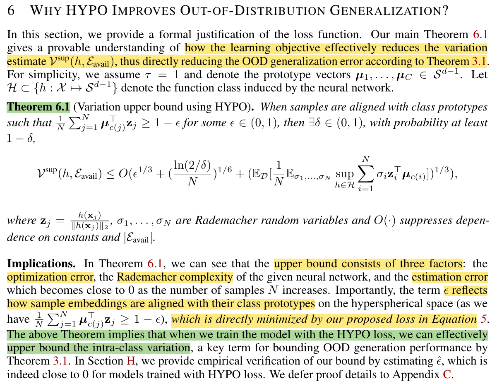

## HYPO: Hypershperical Out-of-Distribution Generalization

* Authors: Haoyue Bai*, Yifei Ming*, Julian Katz-Samuels, Yixuan Li
* Published: ICLR 2024
* Topic: OOD, OOD Generalization
* Link: https://openreview.net/forum?id=VXak3CZZGC

---

### What? 

The authors introduce theoretical guarantees that hyperspherical embeddings learn domain-invariant representations.

### Why?

The same authors previously proposed [CIDER](./12_ming2023how.md) (ICLR 2023), a novel representation learning method that leverages hyperspherical embeddings to enhance out-of-distribution (OOD) detection. Specifically, they propose a compactness loss, designed to minimize the distance of samples to their respective class prototypes, alongside a dispersion loss which enforces increased angular distance between different class prototypes.

Besides their previous work, hyperspherical representations have been widely adopted for OOD detection. However, no one previously attempted to provide theoretical guarantees.

### How?

  
    

First, the authors define the OOD generalization error as the difference between the maximum error across "all" domains and the maximum error obtained on the "known" domains (i.e., the ones used for training). This is formally bounded by the intra-class variation estimate $\mathcal V$ on the available domains, according to:

    

Thus, bounding the inter-class variation becomes fundamental to reducing the OOD generalization error. To promote low variation (aligning representations across domains for every class) and high separation (separating prototypes across different classes), the authors propose designing enforced hyperspherical embeddings.

> The method itself is described on a previous [summary](https://openreview.net/forum?id=VXak3CZZGC).

Lastly, they formally prove why this hyperspherical representation learning improves OOD generalization.

    

