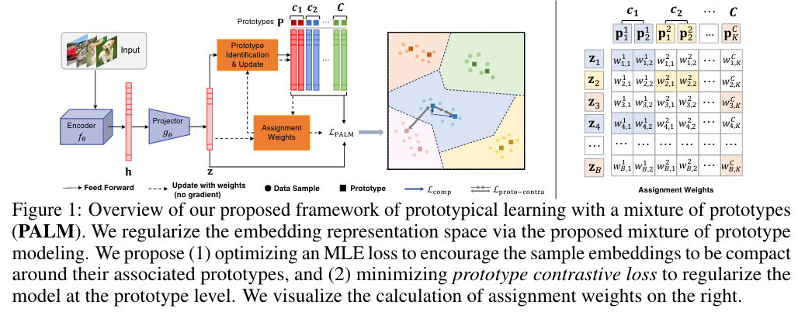

## Learning with Mixture of Prototypes for Out-of-Distribution Detection

* Authors: Haodong Lu, Dong Gong, Shuo Wang, Jason Xue, Lina Yao, Kristen Moore
* Published: ICLR 2024
* Topic: OOD, Prototypical learning, Hyperspherical embedding
* Link: https://openreview.net/forum?id=uNkKaD3MCs

---

### What?

The authors introduce PrototypicAl Learning with a Mixture of prototypes (PALM), a novel method for OOD detection based on hyperspherical embeddings. PALM uses multiple prototypes per class to discriminate between in-distribution (ID) and out-of-distribution (OOD) samples. 

### Why?

Hyperspherical embeddings have proven effective for OOD tasks. However, collapsing all same-class samples into a single prototype can result in inaccurate or misleading representations. A mixture of prototypes per class better represents class diversity (e.g., different dog or cat breeds).

### How?

    

First, the generated feature embeddings $\textbf{h} \in \mathbb{R}^E$ are projected to a lower-dimensional hyperspherical embedding $\textbf{z}$.

The embedding space is modeled as a mixture of von Mises-Fisher (vMF) distributions, each defined by a mean $\textbf{p}_k$ and a concentration parameter $\kappa$:

$$
p_D(\textbf{z},\textbf{p}_k,\kappa) = Z_D(\kappa)\exp(\kappa \textbf{p}_k^\intercal)
$$

where $\textbf{p}_k$ is the $k$-th prototype with unit norm, $\kappa \geq 0$ represents the tightness around the mean, and $Z_D(\kappa)$ is the normalization factor.

Previous works used one prototype per class, while PALM uses $K$ prototypes per class $\textbf{P}^c = {\textbf{p}_k^c}$. Each embedding $\textbf{z}_i$ is assigned to the prototypes via assignment weights $\textbf{w}_i^c \in \mathbb{R}^K$, and the probability density for a sample $\textbf{z}_i$ in class $c$ is defined as a mixture model:

$$
p(\textbf{z}_i; \textbf{w}_i^c, \textbf{P}^c, \kappa) = \sum_{k=1}^K w_{i,k}^c Z_D(\kappa)\exp(\kappa \textbf{p}_k^c\intercal z_i)
$$

Using a fixed number of prototypes per class, an embedding is assigned to class $c$ according to a normalized probability:

$$
p(y_i =c | \textbf{z}_i; \{ \textbf{w}_i^j, \textbf{P}^c, \kappa) \}_{j^=1}^C) = \frac {\sum_{k=1}^K ...} {\sum_{j=1}^C\sum_{k'=1}^K...}
$$

The $\mathcal{L}_{MLE}$ loss encourages samples to be close to their proper prototypes, considering the assignment weights $w{i,k}$.

To enforce intra-class compactness and inter-class discrimination at the prototype level, the authors propose a prototype-contrastive loss:

$$
\mathcal{L}_{proto-contra} = - \frac 1 {CK} \sum_{c=1}^C \sum_{k=1}^K \log \frac{\sum_{k'}^K \mathbb{1}(k' \neq k)\exp(\textbf{p}_k^{c \ \intercal} \textbf{p}_{k'}^c/ \tau) } {\sum_{c'}^C\sum_{k''}^K \mathbb{1}(k'' \neq k, c' \neq k)\exp(\textbf{p}_k^{c \ \intercal} \textbf{p}_{k''}^P{c'}/ \tau)} 
$$

Thus, the resulting loss function becomes:

$$
\mathcal{L} = \mathcal{L}_{MLE} + \lambda \mathcal{L}_{proto-contra}
$$

Lastly, the assignment weights are calculated as follows. Given $K$ prototypes of class $c$ and a batch $B$ of embeddings $\textbf{Z}$, with $B_c$ samples $\textbf{Z}^c$ in class $c$:

$$
\textbf{W}^c = \texttt{diag}(\textbf{u}) \exp (\frac {\textbf{P}^{c \ \intercal} \textbf{Z}^c} {\epsilon}) \texttt{diag}(\textbf{v})
$$

where $\textbf{u}$ and $\textbf{v}$ are nonnegative renormalization vectors.

### And?

* PALM outperforms supervised approaches in widely adopted benchmarks.
* PALM outperforms unsupervised approaches in widely adopted benchmarks.
    * In the unsupervised setting, class information is neglected with respect to the prototype, but prototype assignment is learned unsupervisedly.
* PALM generalizes across KNN and Mahalanobis distance.